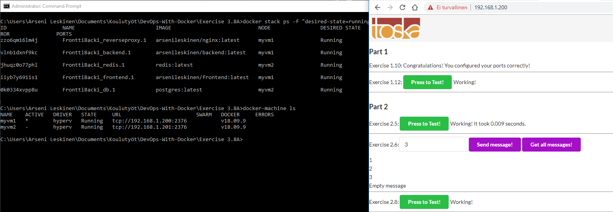

I created 2 Hyper-V VMs, which are then configured to be in a Docker swarm. 

Next I made **myvm1** as swarm leader and **myvm2** as swarm worker by using docker swarm init for the myvm1 and following console output guidance to make myvm2 as worker for it. 

I ended up creating my own nginx image with nginx.conf baked into it as I had issues getting the bind mount path to work in Windows environment. 

Here is final result though. Swarm manager takes care of splitting the workload on myvm1 and myvm2 and the webpage is available through swarm leader ip.

